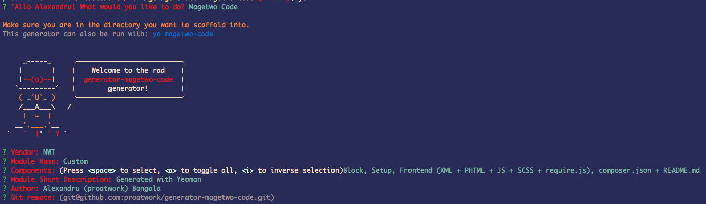
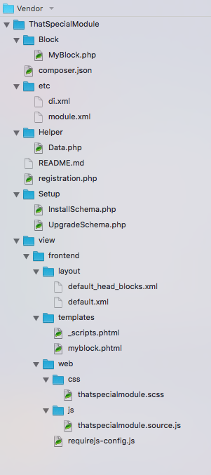

# generator-magetwo-code [![NPM version][npm-image]][npm-url] [![Build Status][travis-image]][travis-url] [![Dependency Status][daviddm-image]][daviddm-url]
## What it does
This generator creates a simple, frontend oriented, barebone Magento2 module

#### If you are starting a new module and want to add it as a composer dependency
- Make sure to add the git remote when prompted (it generates the files directly in that directory without creating the `Vendor/Module` folders.)
- Create the module structure in app/code as so `mkdir -p Vendor/Module/`.
- `cd` into `Vendor/Module`,  `git init` and `git remote add origin ...`
- Run `yo` or `yo magetwo-code`


#### Headsup!

I made the generator with CodeKit in mind, so
- `.scss` should be compiled to `.css`
- `example.source.js` should be compiled/compressed to `example.js` (or whatever name you like)




## Installation

First, install [Yeoman](http://yeoman.io) and generator-magetwo-code using [npm](https://www.npmjs.com/) (we assume you have pre-installed [node.js](https://nodejs.org/)).

```bash
npm install -g yo
npm install -g generator-magetwo-code
```

Then generate your new project:

```bash
yo magetwo-code
```
or simply write
```bash
yo
```
and select `Magetwo Code`

## Updating
You can update by running `yo` and then selecting `Update your generators`

## TODO
* Add widget support
* Add support for creating system config menus


## Getting To Know Yeoman

 * Yeoman has a heart of gold.
 * Yeoman is a person with feelings and opinions, but is very easy to work with.
 * Yeoman can be too opinionated at times but is easily convinced not to be.
 * Feel free to [learn more about Yeoman](http://yeoman.io/).

## License

Apache-2.0 © [Alexandru (proatwork) Bangala](https://github.com/proatwork)


[npm-image]: https://badge.fury.io/js/generator-magetwo-code.svg
[npm-url]: https://npmjs.org/package/generator-magetwo-code
[travis-image]: https://travis-ci.org/proatwork/generator-magetwo-code.svg?branch=master
[travis-url]: https://travis-ci.org/proatwork/generator-magetwo-code
[daviddm-image]: https://david-dm.org/proatwork/generator-magetwo-code.svg?theme=shields.io
[daviddm-url]: https://david-dm.org/proatwork/generator-magetwo-code
